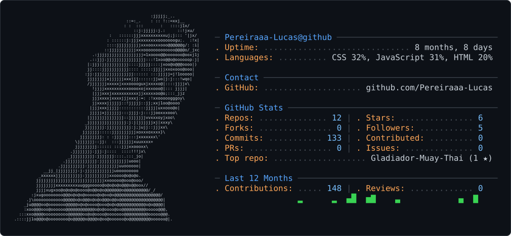

<picture>
  <source media="(prefers-color-scheme: dark)" srcset="dark_mode.svg" />
  <source media="(prefers-color-scheme: light)" srcset="light_mode.svg" />
  
</picture>
<h4 data-importer="text" align="center">Desenvolvedor Front-End e Back-End  em Formação | Análise e Desenvolvimento de Sistemas (ADS) | JavaScript, TypeScript, React.js, Next.js, Tailwind CSS & Python</h4>

###

  
  
  

###

  
  
  
  
  
  
  
  
  
  
  
  
  
  
  
  
  
  
  
  
  
  
  
  
  
  
  

###

  
  

###

###

 

###

  

###

  

###

  

###

  

###

<picture data-importer="pacman">
  <source media="(prefers-color-scheme: dark)" srcset="https://raw.githubusercontent.com/Pereiraaa-Lucas/Pereiraaa-Lucas/pacman-output/pacman-contribution-graph-dark.svg?game=pacman">
  <source media="(prefers-color-scheme: light)" srcset="https://raw.githubusercontent.com/Pereiraaa-Lucas/Pereiraaa-Lucas/pacman-output/pacman-contribution-graph.svg?game=pacman">
  
</picture>

###

<picture data-importer="pacman">
  <source media="(prefers-color-scheme: dark)" srcset="https://raw.githubusercontent.com/Pereiraaa-Lucas/Pereiraaa-Lucas/pacman-output/pacman-contribution-graph-dark.svg?game=pacman">
  <source media="(prefers-color-scheme: light)" srcset="https://raw.githubusercontent.com/Pereiraaa-Lucas/Pereiraaa-Lucas/pacman-output/pacman-contribution-graph.svg?game=pacman">
  
</picture>

###

Hello World!!

###

  
  

###

  
  
  
  

###

###

<picture data-importer="pacman">
  <source media="(prefers-color-scheme: dark)" srcset="https://raw.githubusercontent.com/Pereiraaa-Lucas/Pereiraaa-Lucas/pacman-output/pacman-contribution-graph-dark.svg?game=pacman">
  <source media="(prefers-color-scheme: light)" srcset="https://raw.githubusercontent.com/Pereiraaa-Lucas/Pereiraaa-Lucas/pacman-output/pacman-contribution-graph.svg?game=pacman">
  
</picture>

###

  

###

  
  
  
  
  
  
  
  
  

###

  
  
  
  
  
  
  
  
  

###

  
  
  
  
  
  
  
  
  

###

  
  
  
  
  
  
  
  
  

###

  

###

  

###

  
  
  

###

  

###

  

###
